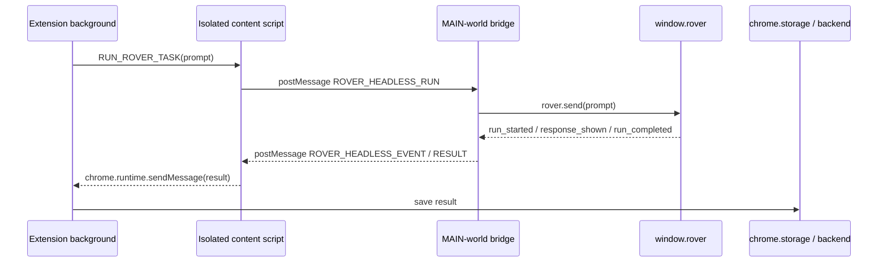

# Headless Rover Control From A Chrome Extension

Use this when your extension wants to trigger Rover programmatically, receive the result, and store or forward it without requiring the user to type into the Rover widget.

This is the right pattern for hackathon extensions that need to gather data from a page, ask Rover to complete a task, and then save the output to `chrome.storage.local`, Firebase, Supabase, your own backend, or another product surface.

## The Short Answer

Yes, an extension can talk to Rover headlessly, but it should do it as an async event flow:

1. Get a Rover config from [Rover Workspace](https://rtrvr.ai/rover/workspace) or [Live Test](https://www.rtrvr.ai/rover/instant-preview?flow=workspace_config).
2. Inject Rover into the page with the packaged `embed.js` runtime.
3. Inject a small MAIN-world bridge that can access `window.rover`.
4. Send a prompt from your extension to the bridge.
5. Listen for Rover events such as `run_started`, `response_shown`, `run_completed`, and `error`.
6. Store the terminal result in the extension background/service worker.

`rover.send(prompt)` does not return the task result synchronously. It starts a Rover run. Subscribe to events to get progress and the final result.

## Why A Bridge Is Needed

Chrome content scripts run in an isolated JavaScript world. Rover runs in the page MAIN world. That means this will not reliably work from an isolated content script:

```js
window.rover.send("Get the visible profile summary.");
```

Instead, inject a small bridge into the MAIN world with `chrome.scripting.executeScript({ world: "MAIN" })`, then communicate with it through `window.postMessage`.

## Recommended Flow



## Minimal MAIN-World Bridge

Put this in a packaged extension file such as `page-bridge.js` and inject it with `world: "MAIN"`.

```js
(() => {
  if (window.__MY_ROVER_HEADLESS_BRIDGE__) return;
  window.__MY_ROVER_HEADLESS_BRIDGE__ = true;

  const REQUEST_SOURCE = "my-rover-extension";
  const RESPONSE_SOURCE = "my-rover-extension-rover-bridge";

  function post(type, requestId, payload = {}) {
    window.postMessage({ source: RESPONSE_SOURCE, type, requestId, payload }, "*");
  }

  function waitForRover(timeoutMs = 15000) {
    return new Promise((resolve, reject) => {
      const startedAt = Date.now();
      const tick = () => {
        const rover = window.rover;
        if (rover && typeof rover.send === "function" && typeof rover.on === "function") {
          resolve(rover);
          return;
        }
        if (Date.now() - startedAt > timeoutMs) {
          reject(new Error("Rover did not become ready."));
          return;
        }
        setTimeout(tick, 100);
      };
      tick();
    });
  }

  window.addEventListener("message", async event => {
    if (event.source !== window) return;
    const message = event.data || {};
    if (message.source !== REQUEST_SOURCE || message.type !== "ROVER_HEADLESS_RUN") return;

    const requestId = String(message.requestId || crypto.randomUUID());
    const prompt = String(message.prompt || "").trim();
    const timeoutMs = Number(message.timeoutMs || 120000);
    if (!prompt) {
      post("ROVER_HEADLESS_RESULT", requestId, { status: "failed", error: "Missing prompt." });
      return;
    }

    const unsubscribers = [];
    let finished = false;
    let timeoutId = 0;

    const cleanup = () => {
      while (unsubscribers.length) {
        try {
          unsubscribers.pop()();
        } catch {
          // Ignore event cleanup failures.
        }
      }
    };

    const finish = (status, payload = {}) => {
      if (finished) return;
      finished = true;
      if (timeoutId) clearTimeout(timeoutId);
      cleanup();
      post("ROVER_HEADLESS_RESULT", requestId, { status, ...payload });
    };

    try {
      const rover = await waitForRover();

      unsubscribers.push(rover.on("run_started", payload => {
        post("ROVER_HEADLESS_EVENT", requestId, { event: "run_started", payload });
      }));

      unsubscribers.push(rover.on("response_shown", payload => {
        post("ROVER_HEADLESS_EVENT", requestId, { event: "response_shown", payload });
      }));

      unsubscribers.push(rover.on("run_completed", payload => {
        finish("completed", { result: payload });
      }));

      unsubscribers.push(rover.on("error", payload => {
        finish("failed", { error: payload });
      }));

      timeoutId = setTimeout(() => {
        finish("timeout", { error: "Timed out waiting for Rover to complete." });
      }, timeoutMs);

      rover.send(prompt);
    } catch (error) {
      finish("failed", { error: String(error?.message || error) });
    }
  });
})();
```

## Isolated Content Script Relay

Your isolated content script can relay commands and results between the extension and the page bridge.

```js
const REQUEST_SOURCE = "my-rover-extension";
const RESPONSE_SOURCE = "my-rover-extension-rover-bridge";

chrome.runtime.onMessage.addListener((message, _sender, sendResponse) => {
  if (message?.type !== "RUN_ROVER_TASK") return false;

  const requestId = String(message.requestId || crypto.randomUUID());

  const onPageMessage = event => {
    if (event.source !== window) return;
    const data = event.data || {};
    if (data.source !== RESPONSE_SOURCE || data.requestId !== requestId) return;

    chrome.runtime.sendMessage({
      type: data.type,
      requestId,
      payload: data.payload,
    });

    if (data.type === "ROVER_HEADLESS_RESULT") {
      window.removeEventListener("message", onPageMessage);
    }
  };

  window.addEventListener("message", onPageMessage);
  window.postMessage({
    source: REQUEST_SOURCE,
    type: "ROVER_HEADLESS_RUN",
    requestId,
    prompt: String(message.prompt || ""),
    timeoutMs: Number(message.timeoutMs || 120000),
  }, "*");

  sendResponse({ ok: true, requestId });
  return true;
});
```

## Background Storage Example

The background service worker should own persistence and network calls.

```js
chrome.runtime.onMessage.addListener(message => {
  if (message?.type !== "ROVER_HEADLESS_RESULT") return;

  const key = `rover-result:${message.requestId}`;
  chrome.storage.local.set({
    [key]: {
      savedAt: new Date().toISOString(),
      status: message.payload?.status || "unknown",
      result: message.payload?.result || null,
      error: message.payload?.error || null,
    },
  });
});
```

## Example Prompts

Ask for structured output if your extension needs to store or process the result.

```text
Extract the visible name, headline, company, and location from this profile page.
Return compact JSON only with keys: name, headline, company, location, confidence.
```

```text
Find the pricing tier shown on this page that best matches a 20-person team.
Return JSON only with keys: planName, monthlyPrice, reason, sourceText.
```

```text
Summarize the visible job posting. Return JSON only with title, company, location,
requiredSkills, seniority, and applyUrl if visible.
```

## If Rover Is Blocked By CSP

Do not inject a remote `<script src="https://rover.rtrvr.ai/embed.js">` tag on strict sites. Package the runtime files with your extension and inject them with `chrome.scripting.executeScript`.

See [EXTENSION_USERS.md](./EXTENSION_USERS.md) for the packaging pattern.

## Guardrails

- Only automate pages, accounts, and data you are allowed to access.
- Keep host permissions narrow, for example `https://www.linkedin.com/*` instead of `<all_urls>` when possible.
- Use public Rover site keys/config from Workspace. Never ship admin credentials or private service tokens in an extension.
- Do not store full page HTML or private user data unless your users explicitly opted into that behavior.
- Prefer compact JSON results and bounded event payloads.
