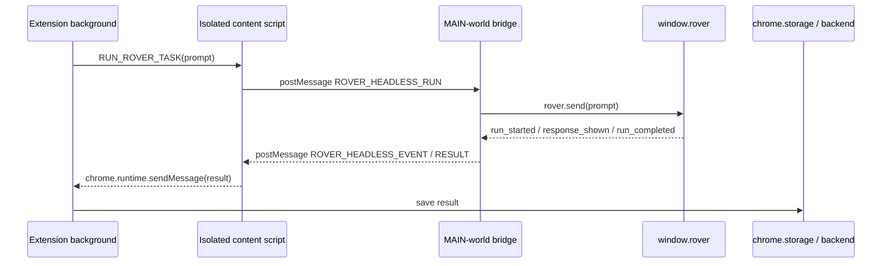

# Headless Rover Control From A Chrome Extension

Use this when your extension wants to trigger Rover programmatically, receive the result, and store or forward it without requiring the user to type into the Rover widget.

This is the right pattern for hackathon extensions that need to gather data from a page, ask Rover to complete a task, and then save the output to `chrome.storage.local`, Firebase, Supabase, your own backend, or another product surface.

Verified against the Rover SDK currently served from `https://rover.rtrvr.ai` (`embed-core` 3.x). `dist/vendor/VERSION.json` records the exact revision this repo packaged.

## The Short Answer

Yes, an extension can talk to Rover headlessly, but it should do it as an async event flow:

1. Get a Rover config from [Rover Workspace](https://rtrvr.ai/rover/workspace) or [Live Test](https://www.rtrvr.ai/rover/instant-preview?flow=workspace_config).
2. Inject Rover into the page with the packaged `embed-core.js` runtime.
3. Inject a small MAIN-world bridge that can access `window.rover`.
4. Send a prompt from your extension to the bridge.
5. Listen for the run lifecycle events and settle on the first terminal one.
6. Store the terminal result in the extension background/service worker.

`rover.send(prompt)` does not return the task result. It starts a Rover run and returns immediately. Subscribe to events to get progress and the final result.

## Why A Bridge Is Needed

Chrome content scripts run in an isolated JavaScript world. Rover runs in the page MAIN world. That means this will not reliably work from an isolated content script:

```js
window.rover.send("Get the visible profile summary.");
```

Instead, inject a small bridge into the MAIN world with `chrome.scripting.executeScript({ world: "MAIN" })`, then communicate with it through `window.postMessage`.

## Recommended Flow


```mermaid
sequenceDiagram
  participant BG as Extension background
  participant CS as Isolated content script
  participant Bridge as MAIN-world bridge
  participant Rover as window.rover
  participant Store as chrome.storage / backend

  BG->>CS: RUN_ROVER_TASK(prompt)
  CS->>Bridge: postMessage ROVER_HEADLESS_RUN
  Bridge->>Rover: rover.send(prompt)
  Rover-->>Bridge: run_started / response_shown / run_completed
  Bridge-->>CS: postMessage ROVER_HEADLESS_EVENT / RESULT
  CS-->>BG: chrome.runtime.sendMessage(result)
  BG->>Store: save result
```

## The SDK Surface You Get After Boot

Once the runtime has booted, `window.rover` is the API object (before that it is a queue shim — a bare function with `.q` and no methods, which is why the bridge waits for `typeof rover.send === "function"`).

Methods most headless integrations use:

| Method | Purpose |
|---|---|
| `send(prompt, options?)` | Start a run. `options` accepts `playbookId` and `engagementKind`. Returns nothing. |
| `on(event, handler)` | Subscribe. Returns an unsubscribe function. |
| `newTask(options?)` | Close out the current task and allocate a fresh one. Clears the transcript unless `clearUi: false`. |
| `endTask(options?)` | Cancel the active run and end the task without starting another. |
| `getState()` | Snapshot of runtime state, mode, and the active task. |
| `registerTool(def, handler)` | Expose one of your own functions to the agent. |
| `registerPromptContextProvider(fn)` | Add page context to every prompt. |
| `open()` / `close()` / `show()` / `hide()` | Widget visibility. |
| `identify()` / `group()` / `resetIdentity()` / `trackConversion()` | Visitor identity and analytics. |
| `update(config)` / `shutdown()` | Re-configure or tear down the instance. |

## Run Lifecycle Events

| Event | When it fires | Headless use |
|---|---|---|
| `ready` | Runtime worker is up | Optional readiness signal |
| `run_started` | A run began | Progress |
| `status` | Stage/thought updates during a run | Progress |
| `tool_start` / `tool_result` | Agent tool activity | Progress |
| `response_shown` | Assistant text is rendered | Capture text; `responseKind` is `checkpoint`, `final`, `question`, or `error` |
| `run_state_transition` | Any run state change | **The only signal for a parked run** |
| `run_completed` | Run reached a terminal state | Primary terminal signal |
| `auth_required` | Run is blocked until a human signs in | Terminal for headless |
| `navigation_guardrail` | A navigation was held back by policy | Diagnostics |
| `error` | Something failed | Terminal only for some scopes — see below |

### The `run_completed` / `run_state_transition` payload

Both events carry the same shape:

```js
{
  runId, executionId, runBoundaryId,
  terminalState,      // "completed" | "failed" | "waiting_input" | "in_progress"
  continuationReason, // "loop_continue" | "same_tab_navigation_handoff" | "awaiting_user"
  runComplete,        // boolean
  needsUserInput,     // boolean
  summary,            // the assistant's final answer text, when Rover produced one
  error,              // failure detail, when there is one
  ok,                 // boolean
  questions,          // [{ key, query, choices?, required?, sensitive? }]
  endedAt, outcome, pageUrl
}
```

`outcome` is the field to branch on: `success`, `failure`, `partial`, or `abandoned`. **`run_completed` fires for failures too**, so treating it as success is wrong.

### Three traps that make a headless run look like it hangs

**1. A parked run never emits `run_completed`.** If Rover needs a clarifying answer, it transitions to `terminalState: "waiting_input"` with `needsUserInput: true` and emits only `run_state_transition`. A bridge that waits solely on `run_completed` sits there until its timeout. Subscribe to `run_state_transition` and settle on `needsUserInput`.

The public SDK cannot answer those questions in place — `send()` always starts a new task. So either write self-contained prompts that don't need clarification, or read `questions` and re-`send()` a prompt with the answers folded in.

**2. Not every `error` belongs to your run.** Rover emits `error` for background subsystems too, tagged with a `scope`:

| `scope` | Fatal to your run? |
|---|---|
| `run_input` | Yes — the prompt never dispatched |
| *(no scope)* | Two shapes arrive unscoped: a worker execution error (`{ message, runId }`) and a server-unavailable transport error (`{ message, route, code, status }`). Neither forces a terminal transition, so give the run a bounded grace window to report its own outcome before calling it failed |
| `roverbook_attach`, `run_cancel_repair`, `session_binding`, `attachment_upload`, `resume` | No — background subsystem noise |

Failing the run on any `error` aborts healthy runs.

**3. One dispatch at a time.** The runtime silently suppresses a second `send()` while a prompt dispatch is in flight. Guard in your bridge so a concurrent request reports `busy` instead of vanishing.

## Minimal MAIN-World Bridge

Put this in a packaged extension file such as `page-bridge.js` and inject it with `world: "MAIN"`. The hardened version — concurrency guard, error grace window, `newTask` support — is in [examples/headless-control-extension/page-bridge.js](./examples/headless-control-extension/page-bridge.js).

```js
(() => {
  if (window.__MY_ROVER_HEADLESS_BRIDGE__) return;
  window.__MY_ROVER_HEADLESS_BRIDGE__ = true;

  const REQUEST_SOURCE = "my-rover-extension";
  const RESPONSE_SOURCE = "my-rover-extension-rover-bridge";
  const IGNORED_ERROR_SCOPES = new Set([
    "roverbook_attach", "run_cancel_repair", "session_binding", "attachment_upload", "resume"
  ]);

  function post(type, requestId, payload = {}) {
    window.postMessage({ source: RESPONSE_SOURCE, type, requestId, payload }, "*");
  }

  function waitForRover(timeoutMs = 20000) {
    return new Promise((resolve, reject) => {
      const startedAt = Date.now();
      const tick = () => {
        const rover = window.rover;
        if (rover && typeof rover.send === "function" && typeof rover.on === "function") {
          resolve(rover);
          return;
        }
        if (Date.now() - startedAt > timeoutMs) {
          reject(new Error("Rover did not become ready."));
          return;
        }
        setTimeout(tick, 100);
      };
      tick();
    });
  }

  window.addEventListener("message", async event => {
    if (event.source !== window) return;
    const message = event.data || {};
    if (message.source !== REQUEST_SOURCE || message.type !== "ROVER_HEADLESS_RUN") return;

    const requestId = String(message.requestId || crypto.randomUUID());
    const prompt = String(message.prompt || "").trim();
    const timeoutMs = Number(message.timeoutMs || 180000);
    if (!prompt) {
      post("ROVER_HEADLESS_RESULT", requestId, { status: "failed", error: "Missing prompt." });
      return;
    }

    const unsubscribers = [];
    let finished = false;
    let timeoutId = 0;
    let latestText = "";

    const finish = (status, payload = {}) => {
      if (finished) return;
      finished = true;
      if (timeoutId) clearTimeout(timeoutId);
      while (unsubscribers.length) {
        try {
          unsubscribers.pop()();
        } catch {
          // Ignore event cleanup failures.
        }
      }
      post("ROVER_HEADLESS_RESULT", requestId, { status, text: latestText, ...payload });
    };

    try {
      const rover = await waitForRover();

      unsubscribers.push(rover.on("run_started", payload => {
        post("ROVER_HEADLESS_EVENT", requestId, { event: "run_started", payload });
      }));

      unsubscribers.push(rover.on("response_shown", payload => {
        post("ROVER_HEADLESS_EVENT", requestId, { event: "response_shown", payload });
        const text = String(payload?.text || "").trim();
        if (text) latestText = text;
      }));

      // A parked run only reports here — run_completed never fires for it.
      unsubscribers.push(rover.on("run_state_transition", payload => {
        if (payload?.needsUserInput !== true) return;
        finish("needs_input", { questions: payload?.questions || [], raw: payload });
      }));

      unsubscribers.push(rover.on("run_completed", payload => {
        finish(payload?.outcome === "success" ? "completed" : "failed", {
          runId: payload?.runId,
          outcome: payload?.outcome,
          summary: payload?.summary || "",
          error: payload?.error || null,
          raw: payload
        });
      }));

      unsubscribers.push(rover.on("auth_required", payload => {
        finish("auth_required", { error: String(payload?.message || "Sign-in required."), raw: payload });
      }));

      // The hardened bridge waits ~15s here for a terminal signal before calling an
      // unscoped error fatal, because Rover can recover and still complete the run.
      unsubscribers.push(rover.on("error", payload => {
        const scope = String(payload?.scope || "");
        if (scope && IGNORED_ERROR_SCOPES.has(scope)) return;
        finish("failed", { error: String(payload?.message || "Rover reported an error."), raw: payload });
      }));

      timeoutId = setTimeout(() => {
        finish("timeout", { error: "Timed out waiting for Rover to complete." });
      }, timeoutMs);

      rover.send(prompt);
    } catch (error) {
      finish("failed", { error: String(error?.message || error) });
    }
  });
})();
```

## Isolated Content Script Relay

Your isolated content script can relay commands and results between the extension and the page bridge.

```js
const REQUEST_SOURCE = "my-rover-extension";
const RESPONSE_SOURCE = "my-rover-extension-rover-bridge";

chrome.runtime.onMessage.addListener((message, _sender, sendResponse) => {
  if (message?.type !== "RUN_ROVER_TASK") return false;

  const requestId = String(message.requestId || crypto.randomUUID());

  const onPageMessage = event => {
    if (event.source !== window) return;
    const data = event.data || {};
    if (data.source !== RESPONSE_SOURCE || data.requestId !== requestId) return;

    chrome.runtime.sendMessage({
      type: data.type,
      requestId,
      payload: data.payload,
    });

    if (data.type === "ROVER_HEADLESS_RESULT") {
      window.removeEventListener("message", onPageMessage);
    }
  };

  window.addEventListener("message", onPageMessage);
  window.postMessage({
    source: REQUEST_SOURCE,
    type: "ROVER_HEADLESS_RUN",
    requestId,
    prompt: String(message.prompt || ""),
    timeoutMs: Number(message.timeoutMs || 180000),
    // Acted on by the hardened bridge in examples/; the minimal bridge above
    // ignores it and lets send() open the task itself.
    startNewTask: message.startNewTask === true,
  }, "*");

  sendResponse({ ok: true, requestId });
  return true;
});
```

## Background Storage Example

The background service worker should own persistence and network calls.

```js
chrome.runtime.onMessage.addListener(message => {
  if (message?.type !== "ROVER_HEADLESS_RESULT") return;

  const payload = message.payload || {};
  const key = `rover-result:${message.requestId}`;
  chrome.storage.local.set({
    [key]: {
      savedAt: new Date().toISOString(),
      // completed | failed | needs_input | auth_required | timeout | busy
      status: payload.status || "unknown",
      outcome: payload.outcome || null,
      text: payload.text || "",          // the answer: summary, else last response_shown
      questions: payload.questions || null,
      error: payload.error || null,
    },
  });
});
```

## Running More Than One Prompt On A Page

Inject the runtime once per document — it is ~1.5 MB, and re-evaluating it makes Rover hand the page over to a fresh instance. Probe first:

```js
const [probe] = await chrome.scripting.executeScript({
  target: { tabId, allFrames: false },
  world: "MAIN",
  func: () => typeof window.rover?.send === "function" && !Array.isArray(window.rover?.q),
});
if (!probe?.result) await injectRover(tabId);
```

For the second and later prompts, close out the previous task first so the new prompt starts from a clean task instead of landing on the current one:

```js
if (typeof rover.newTask === "function") rover.newTask({ reason: "headless_run", source: "public_sdk" });
rover.send(prompt);
```

`newTask()` allocates a new task, resets it to idle, drops any pending run and worker
state, bumps the task epoch, and clears the visible transcript. It does **not**
guarantee a clean slate for the model: Rover always applies a same-window follow-up
heuristic, and a recently finished task — including one `newTask()` just closed — stays
eligible to contribute context when the new prompt overlaps it lexically and lands
inside the follow-up TTL. If a prompt must be interpreted in isolation, say so in the
prompt itself rather than relying on the task boundary.

## Example Prompts

Ask for structured output if your extension needs to store or process the result. Make prompts self-contained — a prompt that needs clarification parks the run in `needs_input` instead of completing.

```text
Extract the visible name, headline, company, and location from this profile page.
Return compact JSON only with keys: name, headline, company, location, confidence.
```

```text
Find the pricing tier shown on this page that best matches a 20-person team.
Return JSON only with keys: planName, monthlyPrice, reason, sourceText.
```

```text
Summarize the visible job posting. Return JSON only with title, company, location,
requiredSkills, seniority, and applyUrl if visible.
```

## If Rover Is Blocked By CSP

Do not inject a remote `<script src="https://rover.rtrvr.ai/embed.js">` tag on strict sites. Package the runtime files with your extension and inject them with `chrome.scripting.executeScript`.

See [EXTENSION_USERS.md](./EXTENSION_USERS.md) for the packaging pattern.

## Guardrails

- Only automate pages, accounts, and data you are allowed to access.
- Keep host permissions narrow, for example `https://www.linkedin.com/*` instead of `<all_urls>` when possible.
- Use public Rover site keys/config from Workspace. Never ship admin credentials or private service tokens in an extension.
- Do not store full page HTML or private user data unless your users explicitly opted into that behavior.
- Prefer compact JSON results and bounded event payloads.
